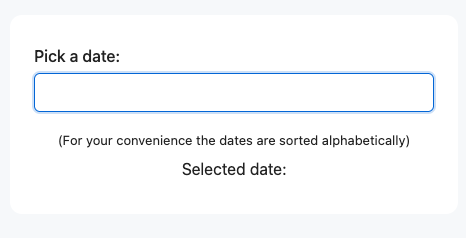
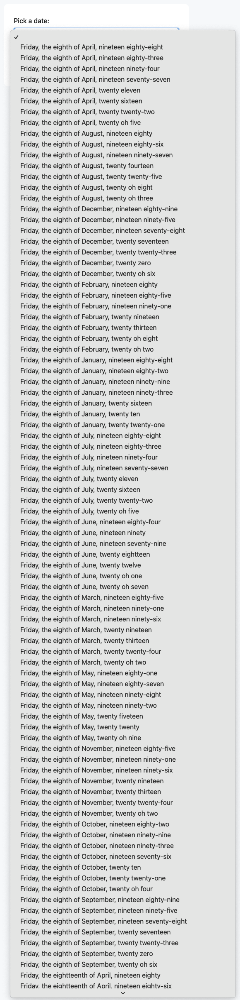

# Bad Date Picker

This is my submission for the Bad UX World Cup 2025 https://badux.lol/

An alphabetically sorted date picker for any date of the last 50 years.

Try it out here: [holistic-developer.github.io/bad-date-picker/](https://holistic-developer.github.io/bad-date-picker/) 

The idea is to create a date picker that is as bad as possible to use.

It demonstrates how the wrong choice for sorting can make or break the user experience.

---

I wanted to build something very simple, without any fancy tooling.

In the end I came up with this index.html that doesn't even need a build step.

Even though this turned out to be more javascript than I thought I would need,
it is still less payload than shipping a statically rendered site with 18250 (50 * 365) options.

